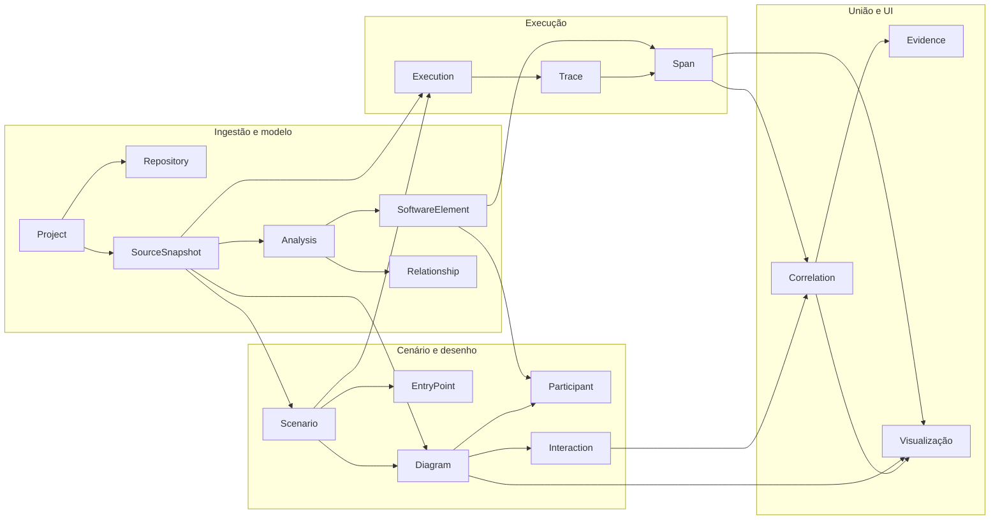

# MVP — Debugador

**Software Architecture & Execution Explorer** — cruza código estático, cenários/diagramas e execução (trace/span) para explicar como o software realmente se comporta.

Documento de produto (DBG-001). Modelo técnico e bounded contexts: [docs/architecture/README.md](../architecture/README.md). Contrato HTTP atual: [docs/openapi.yaml](../openapi.yaml).

---

## Problema e para quem

### Problema

Engenheiros que mantêm ou evoluem um serviço precisam responder perguntas como: *quem chama quem*, *o que roda de fato em produção ou em teste*, e *onde o desenho diverge da realidade*. Hoje isso exige juntar manualmente IDE, diagramas desatualizados, logs e traces — sem um lugar que una **estrutura do código**, **intenção do fluxo (cenário)** e **evidência de execução**.

### Persona principal

**Engenheiro de software / mantenedor** de um serviço Java (time pequeno ou médio), familiar com Git e com necessidade de entender um fluxo ponta a ponta antes de refatorar ou corrigir incidentes.

### Para quem não é (no MVP)

Times que precisam apenas de APM genérico, documentação estática sem execução, ou suporte multi-linguagem no primeiro release.

---

## Visão e hipótese

**Visão (uma frase):** O Debugador é o explorador que alinha modelo extraído do código, diagrama do cenário e trace real, para que o engenheiro veja o fluxo completo com evidência.

**Hipótese do MVP:** Se registrarmos um **projeto** ligado a um **repositório**, gerarmos um **snapshot** e uma **análise** que produza **elementos e relações**, definirmos um **cenário** com **diagrama**, capturarmos uma **execução** com **trace/spans** e **correlacionarmos** spans às interações do diagrama, então uma **visualização única** permitirá ao engenheiro validar o fluxo vertical sem ferramentas dispersas — mesmo para um único serviço e um cenário feliz.

---

## Fluxo ponta a ponta (cadeia que o MVP deve provar)

Ordem lógica de entidades e artefatos (linguagem ubíqua alinhada ao schema Flyway `V1__initial_schema.sql`):

`Project` → `Repository` → `SourceSnapshot` → `Analysis` → `SoftwareElement` / `Relationship` → `Execution` → `Trace` / `Span` → `Correlation` → `Scenario` → `Diagram` → **Visualização** (UI)

> **Nota de produto:** Na operação do usuário, **Scenario** e **Diagram** costumam ser definidos *antes* de disparar uma **Execution** (o cenário referencia snapshot e ponto de entrada; a execução referencia o cenário). A cadeia acima é a **prova de valor do MVP**: todos os nós devem existir e ser consultáveis até a UI integrar modelo, diagrama, execução e correlação. **Correlation** exige diagrama (interações) e spans; a visualização final consome os três eixos.

Referência de correlação no baseline arquitetural: *SoftwareModel + Diagram + Execution → Correlation* ([architecture](../architecture/README.md)).

---

## Escopo IN

| Área | O que entra no MVP |
|------|---------------------|
| Projeto | Um **Project** por workspace lógico; **um Repository** por projeto (provider, URL, branch padrão). |
| Código | **SourceSnapshot** identificado por commit (e branch opcional) associado ao projeto. |
| Análise estática | **Analysis** assíncrona (worker) sobre o snapshot; status e erro persistidos; saída **SoftwareElement** e **Relationship** (tipos limitados ao necessário para um fluxo HTTP/serviço Java demonstrável). |
| Cenário | **Scenario** amarrado a projeto + snapshot; **EntryPoint** (ex.: método ou rota) que dispara o fluxo. |
| Diagrama | **Diagram** versionado por cenário; **Participant** ligado a elementos quando possível; **Interaction** com âncoras no código (file/symbol/linhas). |
| Execução | **Execution** por cenário; **Trace** (id externo) e **Span** hierárquicos; spans com metadados para mapear a elementos quando o agente permitir. |
| Correlação | **Correlation** entre **Interaction** e **Span** com **confidence** e **Evidence** auditável. |
| API | Operações REST sob `/api/v1` para criar/consultar o fluxo (evolução do OpenAPI existente). |
| Tempo real | Canal WebSocket para progresso/eventos de execução (endpoint já esboçado na API). |
| UI | Visualização mínima: projeto → snapshot/análise → cenário/diagrama → execução com overlay de correlação (não precisa ser polida; precisa ser **verificável**). |
| Stack | Monólito modular Java 21 + Spring Boot, PostgreSQL 17, Flyway, Redis, worker analyzer, agent Java skeleton, React + Vite — conforme [README.md](../../README.md). |
| Ambiente | `docker compose up --build` sobe API, web, postgres, redis, analyzer. |

---

## Escopo OUT

| Item | Motivo |
|------|--------|
| Multi-repositório por projeto | Premissa MVP: 1 repo por projeto. |
| AuthN/AuthZ, multi-tenant, SSO | Não bloqueia prova técnica do fluxo vertical. |
| Suporte a linguagens além de Java no analyzer/agent | Foco no caminho feliz Java. |
| Deploy em nuvem gerenciada, HA, sharding | Fora do monólito modular local. |
| Editor de diagrama rico (UML completo, colaboração) | Diagrama mínimo sequencial/lifelines suficiente para correlação. |
| ML para correlação | Regras determinísticas + confidence; evidências explícitas. |
| Integração GitHub App (webhooks, PR comments) | Pode usar URL de repo e snapshot por commit informado manualmente ou job simples. |
| Replay histórico massivo de traces | Uma execução demonstrável por cenário basta no MVP. |
| Mobile, plugins IDE completos | UI web apenas. |

---

## Etapas do fluxo: objetivo, resultado verificável, dependências

| Etapa | Objetivo | Resultado verificável | Depende de |
|-------|----------|------------------------|------------|
| **Project** | Registrar o serviço sob exploração | `POST /projects` retorna `id`; `GET /projects` lista o projeto; registro persistido (não apenas memória de processo) | — |
| **Repository** | Vincular origem do código | Linha em `repository` com `project_id`, `provider`, `url`, `default_branch`; API expõe URL/branch no recurso projeto | Project |
| **SourceSnapshot** | Fixar versão analisável | Registro com `commit_hash` único por projeto; API ou job cria snapshot | Project, Repository |
| **Analysis** | Extrair modelo estático | `analysis.status` ∈ {RUNNING, SUCCEEDED, FAILED}; se SUCCEEDED, `finished_at` preenchido | SourceSnapshot, worker analyzer |
| **SoftwareElement / Relationship** | Materializar grafo de código | Contagem > 0 de elementos e relações para análise bem-sucedida; consulta API ou SQL documentada | Analysis concluída |
| **Execution** | Representar uma corrida do cenário | `execution` com `scenario_id`, `status`, timestamps; disparo manual ou via agente | Scenario (ver nota), Snapshot |
| **Trace / Span** | Capturar árvore de chamadas | `trace` 1:1 com execution; spans com `parent_span_id`, `duration_ms`, ordem temporal coerente | Execution, java-agent (evoluído) |
| **Correlation** | Ligar desenho à realidade | Registros em `correlation` com `confidence` ∈ [0,1] e ≥1 `evidence` por correlação aceita | Interaction, Span |
| **Scenario** | Nomear fluxo e entrada | `scenario` + `entry_point` referenciando snapshot; API CRUD mínimo | Project, SourceSnapshot |
| **Diagram** | Descrever participantes e mensagens | `diagram` com `version`; participants e interactions persistidos; interactions referenciam snapshot | Scenario, SoftwareElement (opcional mas desejável) |
| **Visualização** | Mostrar o cruzamento | UI exibe diagrama + lista/timeline de spans + destaque das interações correlacionadas; WebSocket reflete status de execução | Todos os anteriores para demo completa |

**Ordem operacional recomendada (jornada):** Project → Repository → SourceSnapshot → Analysis → Elements/Relationships → **Scenario → Diagram** → Execution → Trace/Span → Correlation → Visualização.

---

## Estado atual do repositório (resumo)

Levantamento em relação ao fluxo (código em `debugador-mvp/`).

| Etapa | Schema DB (Flyway) | OpenAPI | API / domínio | Worker / Agent | Web UI |
|-------|-------------------|---------|---------------|----------------|--------|
| Project | Sim (`project`) | Sim (`POST/GET /projects`) | **Parcial** — `ProjectController` em memória; JPA `ProjectJpaEntity` sem uso no controller | — | Shell estático |
| Repository | Sim (`repository`) | Parcial (dentro de create) | **Não** — não persiste tabela `repository` | — | — |
| SourceSnapshot | Sim | Não | **Não** | **Não** | — |
| Analysis | Sim | Não | **Não** | **Esqueleto** (`AnalyzerApplication` vazio) | — |
| SoftwareElement / Relationship | Sim | Não | **Não** | **Não** | — |
| Scenario / EntryPoint | Sim | Não | **Não** | — | — |
| Diagram / Participant / Interaction | Sim | Não | **Não** | — | — |
| Execution | Sim | Não | **Parcial** — WebSocket `/ws/executions/{executionId}` (mensagem CONNECTED apenas) | — | — |
| Trace / Span | Sim | Não | **Não** | — | — |
| Correlation / Evidence | Sim | Não | **Não** | — | — |
| Visualização | — | — | — | — | **Não** (landing com links) |
| Infra | Postgres + Redis no compose | — | Flyway + JPA validate | Containers definidos | Vite app |

**Legenda implementação:** **Sim** = artefato presente e alinhado ao domínio; **Parcial** = esboço ou só schema; **Não** = ausente além do schema.

---

## Critérios de sucesso do MVP (demonstráveis)

1. **Fluxo vertical único:** Para um projeto de exemplo (repo Java público ou fixture), é possível criar snapshot → concluir análise → definir cenário + diagrama → registrar execução com trace/spans → persistir ≥1 correlação com evidência.
2. **Persistência:** Reiniciar a API não perde projeto, snapshot, análise, cenário nem execução (PostgreSQL).
3. **Rastreabilidade:** Uma interaction correlacionada abre caminho até file/symbol/linhas no snapshot e até span com timestamps.
4. **API contratada:** OpenAPI descreve os recursos usados na demo; respostas compatíveis com o schema.
5. **UI mínima:** Tela (ou conjunto de telas) que um revisor consegue percorrer sem `curl` para validar o mesmo fluxo da jornada 1 em [journeys.md](./journeys.md).
6. **Observabilidade local:** Health da API e logs do analyzer/agent indicam falha de análise ou ingestão de span.

---

## Restrições e premissas

- **Arquitetura:** Monólito modular; bounded contexts Project, Analysis, Scenario, Diagram, Execution, Correlation ([skill arquitetura](../../skills/arquitetura/SKILL.md)).
- **Domínio independente de ferramentas** (JavaParser, OTel, JPA) na camada de domínio; adapters na infraestrutura.
- **Um repositório Git por projeto** no MVP.
- **Snapshot por commit** — branch opcional, commit obrigatório para análise determinística.
- **Redis** como fila/cache de jobs de análise (premissa do compose).
- **Agent Java** anexável via `-javaagent` (premain existente; integração OTel/Byte Buddy é evolução, não requisito deste card).

---

## Decisões de produto (DBG-001)

| ID | Decisão | Justificativa |
|----|---------|---------------|
| D-01 | MVP prova **um** fluxo feliz end-to-end antes de escalar tipos de elemento/relação | Reduz risco e valida hipótese de correlação |
| D-02 | Diagrama é **derivado assistido** do modelo + edição mínima, não desenho livre | Diagramas devem refletir código ([arquitetura](../../skills/arquitetura/SKILL.md)) |
| D-03 | Correlação exige **evidence** persistida | Evita “match mágico” sem auditoria |
| D-04 | OpenAPI em `docs/openapi.yaml` é fonte de verdade do contrato público; cópia em `apps/api/src/main/resources/openapi/` deve permanecer sincronizada | Evita drift API/documentação |
| D-05 | Cenário sempre amarrado ao **mesmo snapshot** usado na análise exibida | Evita comparar código de um commit com execução de outro sem aviso explícito (avisos podem ser OUT pós-MVP) |

---

## Riscos e pendências (cards seguintes)

| Risco | Impacto | Mitigação esperada |
|-------|---------|-------------------|
| Analyzer ainda não processa jobs | Bloqueia Elements/Relationships | Implementar pipeline no worker + contrato Redis/API |
| Project só em memória | Invalida critério de persistência | Ligar controller ao JPA + `repository` |
| Agent só imprime premain | Sem spans reais | Integrar captura mínima alinhada ao entry point |
| Correlação ambígua | UI confunde usuário | Threshold de confidence + evidências na UI |
| Drift OpenAPI vs implementação | Integração web quebra | Card de API atualiza spec e testes de contrato |

**Pendências sugeridas para próximos cards (não prescritivos além do backlog do projeto):**

- **DBG-002:** Fundação de **Project + Repository** persistidos, alinhamento OpenAPI, testes de integração com Flyway.
- **DBG-003:** **SourceSnapshot**, fila de **Analysis**, worker analyzer produzindo **SoftwareElement** / **Relationship**.
- **DBG-004:** **Scenario**, **Diagram**, APIs de consulta e regras mínimas de geração/edição.

Cards posteriores (execução, agent, correlação, UI vertical — ex. referência futura DBG-034) devem fechar Execution → Trace/Span → Correlation → Visualização.

---

## Métricas de validação (pós-implementação)

- Tempo até primeira análise bem-sucedida após criar projeto (meta interna: < 5 min em ambiente local com repo pequeno).
- % de interações do diagrama demo com pelo menos uma correlação span (meta MVP: 100% no fluxo feliz).
- Reinício da API sem perda de dados (meta: 100% nos testes de fumaça documentados).

---

## Referências

- [README do projeto](../../README.md)
- [Arquitetura](../architecture/README.md)
- [OpenAPI](../openapi.yaml)
- [Schema inicial](../../apps/api/src/main/resources/db/migration/V1__initial_schema.sql)
- [Jornadas de usuário](./journeys.md)
